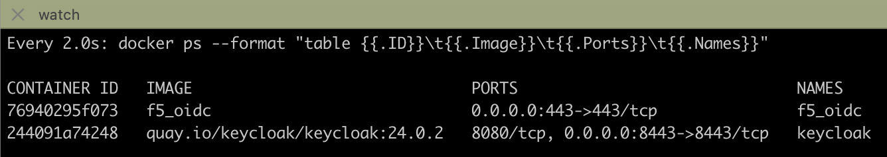
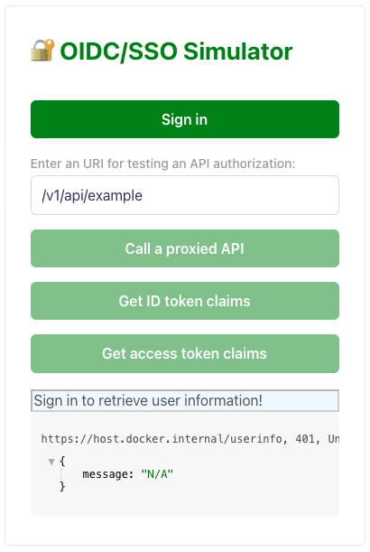
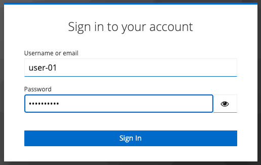
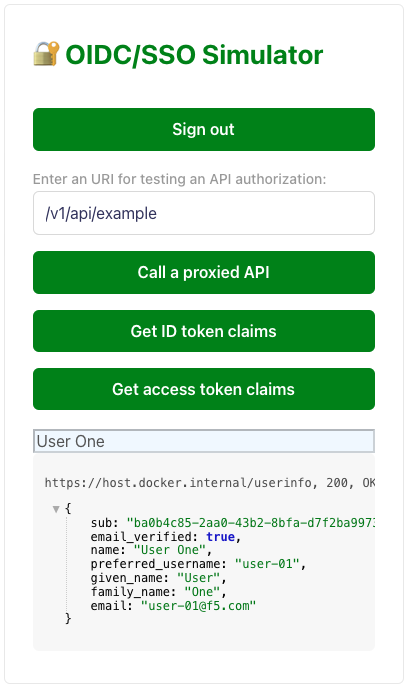
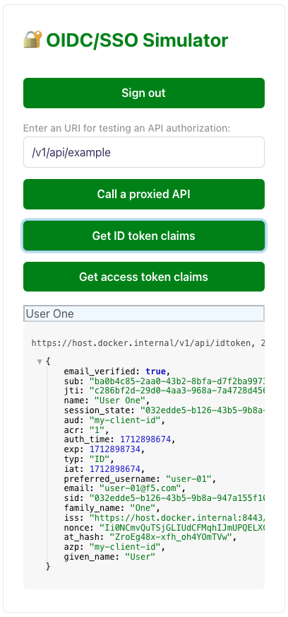
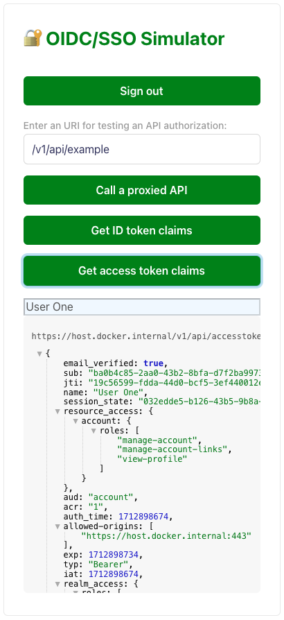
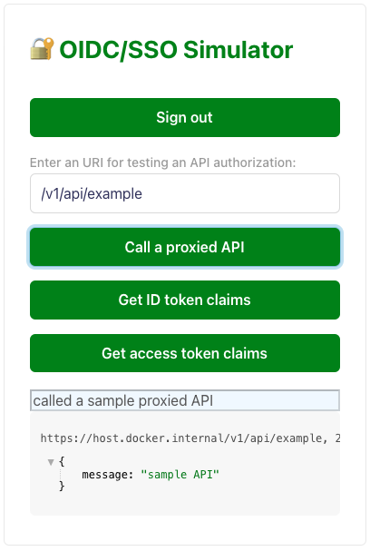

# 🔐 f5-oidc-sso-simulator

The **`f5-oidc-sso-simulator`** provides a OIDC/SSO simulation environment to test user **authentication**, App/API **authorization**, and ID/access **token claims**' retrieval via your IdPs for the following persona and scenarios.

| Persona | Scenario |
|---------|----------|
| **Product Manager, Solution Architect** | **New IdP Support**: I want to test new IdPs to ensure my app's implementation supports it before selling the app. |
| **Solution Engineer, Customer Support** | **SSO Troubleshooting**: I want to test customers' IdP configuration without using my app as one of troubleshooting steps when getting authN errors. |
| **Enterprise Customer** | **Token Claim Extract**: I want to extract and check ID/access token claims with securely protecting PII without using public sites when configuring an IdP. |
| **Software Engineer, Quality Engineer** | **OIDC Test Env**: I want to quickly configure and run SSO test environments when testing my apps. |


## 🏠 Getting Started

### 1. Prerequisites
- [ ] **IdP Setup**: Create an app in your IdP. Use the following URIs if you want to run this tool locally.
  | Category                     | URI Example                                 |
  |------------------------------|---------------------------------------------|
  | **Redirect URI**             | `https://host.docker.internal:443/_codexch` |
  | **Post Logout Redirect URI** | `https://host.docker.internal:443/_logout`  |
- [ ] **Clone** this repo
  ```bash
  git clone https://github.com/f5devcentral/f5-oidc-sso-simulator.git
  ```
- [ ] **Docker**: [Install and Run Docker](https://docs.docker.com/engine/install/)
- [ ] **Host**: Edit `hosts` file when testing your app locally:
  ```bash
  $ sudo vi /etc/hosts
  127.0.0.1 host.docker.internal
  ```
- [ ] **Nginx Plus Free Trial**: [Download Nginx Plus license files](https://www.nginx.com/free-trial-request/), and copy `nginx-repo.crt` and `nginx-repo.key` to `./common/certs/`.

### 2. Configure a Simulator
Skip this step if you just want to locally run this environment with a Keycloak bundle.
- [ ] **DNS**: Edit your DNS resolver in `template/oidc_dns_resolver.conf` as the following example:
  ```nginx
    resolver  127.0.0.11;  # For local Docker DNS lookup
    #resolver 8.8.8.8;     # For DNS lookup of external IDP endpoint
  ```
- [ ] **IdP Endpoints**: Edit `template/oidc_idp.conf`
  ```nginx
    map $oidc_app_identifier $idp_domain {
        default host.docker.internal:8443/realms/master/protocol/openid-connect;
    }
    map $oidc_app_identifier $oidc_authz_endpoint {
        default https://$idp_domain/auth;
    }
    map $oidc_app_identifier $oidc_jwt_keyfile {
        default https://$idp_domain/certs;
    }
    map $oidc_app_identifier $oidc_logout_endpoint {
        default https://$idp_domain/logout;
    }
    map $oidc_app_identifier $oidc_token_endpoint {
        default https://$idp_domain/token;
    }
    map $oidc_app_identifier $oidc_userinfo_endpoint {
        default https://$idp_domain/userinfo;
    }
    map $oidc_app_identifier $oidc_scopes {
        default "openid+profile+email";
    }
    map $oidc_app_identifier $oidc_client {
        default "my-client-id";
    }
    map $oidc_app_identifier $oidc_pkce_enable {
        default 1; # Set value with 0 if secret is needed.
    }
    map $oidc_app_identifier $oidc_client_secret {
        default "{{edit-your-client-secret-unless-pkce-enabled}}";
    }
  ```
- [ ] **Host & Certs**: Edit `template/oidc_proxy_host_certs.conf`
- [ ] **Config Automation**: TBD via `well-known endpoint`.

### 3. Run the Simulator as Docker Containers
- [ ] **Start** Docker containers:
  ```bash
  make start
  ```
- [ ] **Check** Docker containers' status:
  ```bash
  make watch
  ```
  

### 4. Run a Web Browser and Test OIDC/SSO
- [ ] Run a Web Browser with https://host.docker.internal and click `Sign in/out` button:
  | Landing Page | IdP Sign in | User Info after Sign-in |
  |--------------|-------------|-------------------------|
  |  |  |  |
- [ ] Check ID/access token claims and test API authorization
  | ID Token Claims | Access Token Claims | Proxied API Authorization |
  |-----------------|---------------------|---------------------------|
  |  |  |  | 
  > Note: 
  > - Ensure **ID token** contains OIDC standard claim names of **`given_name, family_name, email`** for F5 **Distributed Cloud(XC)** Customers before configuring **F5 XC SSO**.
  > - Authentication error will be occured with XC if your IdP doesn't return ID token.
  > - User Account Information form will be shown in XC if the ID token doesn't contain standard claims.


## 📚 References
- [NGINX OIDC Core and App Examples for multiple Identity Providers](https://github.com/nginx-openid-connect)
- [Amazon Cognito Setup & Nginx Config Example](https://github.com/nginx-openid-connect/nginx-oidc-amazon-cognito)
- [Auth0 Setup & Nginx Config Example](https://github.com/nginx-openid-connect/nginx-oidc-auth0)
- [Azure Entera ID (a.k.a. AD) Setup & Nginx Config Example](https://github.com/nginx-openid-connect/nginx-oidc-azure-ad)
- [Keycloak Setup & Nginx Config Example](https://github.com/nginx-openid-connect/nginx-oidc-keycloak)
- [Okta Setup & Nginx Config Example](https://github.com/nginx-openid-connect/nginx-oidc-okta)
- [OneLogin Setup & Nginx Config Example](https://github.com/nginx-openid-connect/nginx-oidc-onelogin)
- [Ping Identity Setup & Nginx Config Example](https://github.com/nginx-openid-connect/nginx-oidc-ping-identity)
- [Google SSO Setup & F5 Distributed Cloud Example](https://docs.cloud.f5.com/docs/how-to/user-mgmt/sso-google)
- [Custom SSO Setup & & F5 Distributed Cloud Example](https://docs.cloud.f5.com/docs/how-to/user-mgmt/sso-custom)


